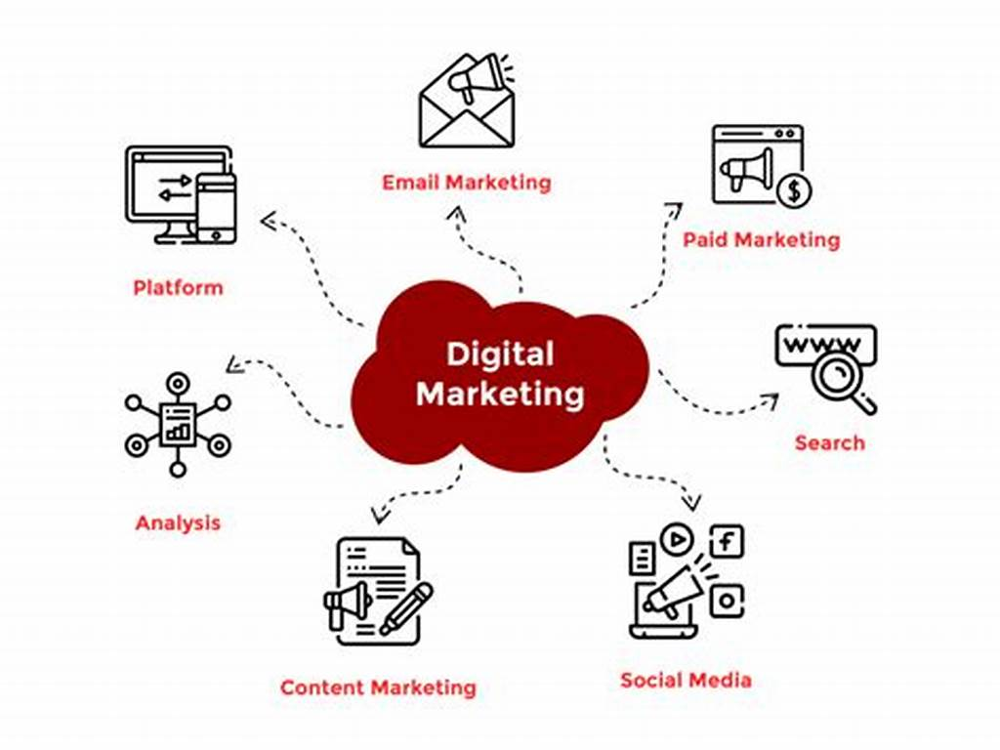
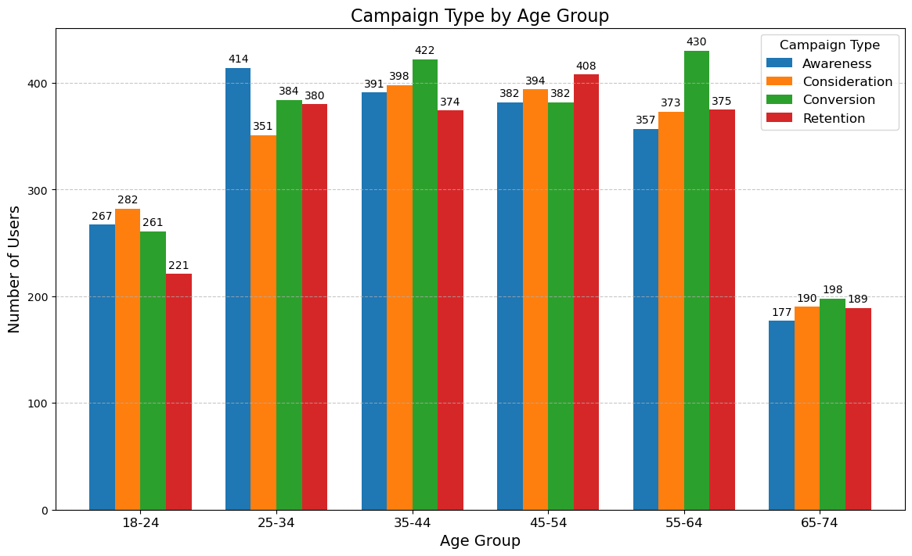
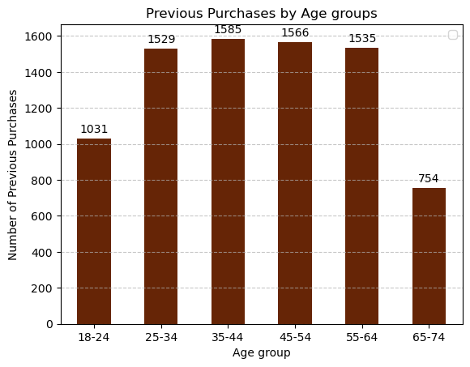
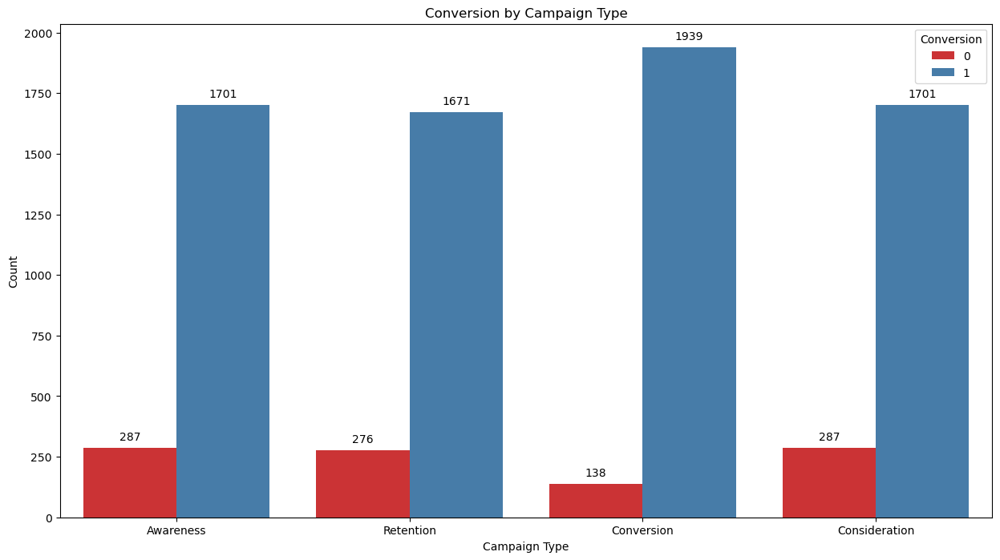
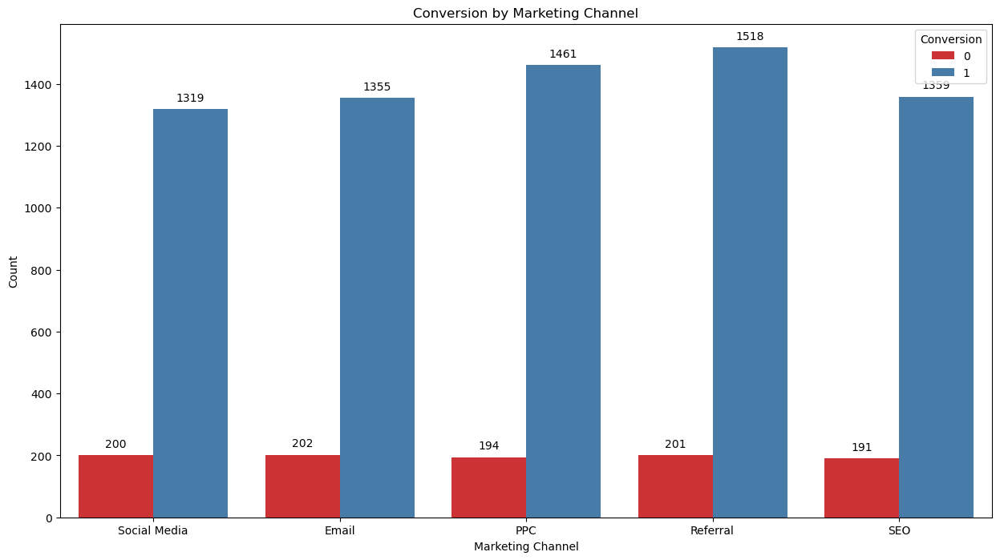
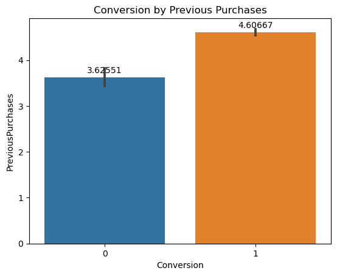
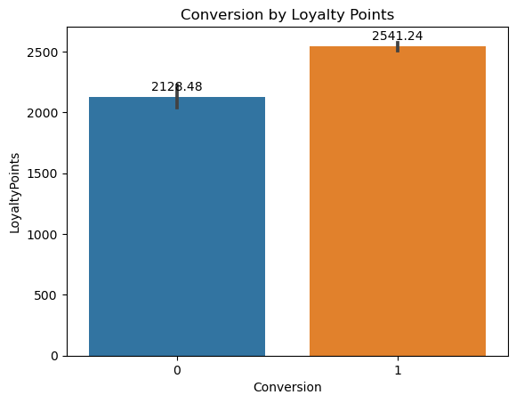
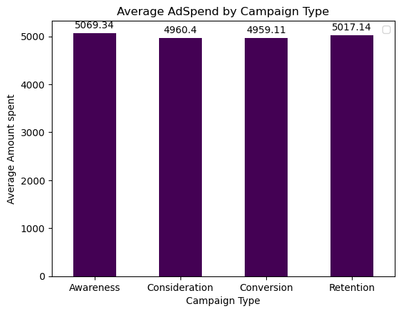

# Digital Marketing Analysis and Conversion Prediction



## Overview

This project aims to enhance the effectiveness of an e-commerce company's digital marketing campaigns by developing a predictive model to identify which customers are most likely to convert after interacting with marketing materials.  
**Goal**: To optimize marketing strategies, improve customer retention, and ultimately increase conversion rates and revenue.

## Table of Contents

- [Business Understanding](#business-understanding)
- [Stakeholders](#stakeholders)
- [Key Business Questions](#key-business-questions)
- [Data Understanding and Analysis](#data-understanding-and-analysis)
- [Source of Data](#source-of-data)
- [Description of Data](#description-of-data)
- [Exploratory Data Analysis](#exploratory-data-analysis)
- [Visualizations](#visualizations)
- [Modeling](#modeling)
- [Results](#results)
- [Conclusions](#conclusions)
- [Installation and Usage](#installation-and-usage)
## Business Understanding

### Stakeholders
Business stakeholders including executives and decision-makers of the e-commerce company.

### Key Business Questions

- What customer demographics and behaviors are most associated with conversion?
- Which marketing channels and types are most effective for different customer segments?
- How can we optimize marketing spend by targeting customers with a higher likelihood of conversion?
- What strategies can be implemented to personalize marketing and improve customer retention?

## Data Understanding and Analysis

### Source of Data

The data for this analysis was obtained from [Kaggle](https://www.kaggle.com/datasets/rabieelkharoua/predict-conversion-in-digital-marketing-dataset/data). It includes:

- **Demographic data**
- **Marketing-specific metrics**
- **Customer engagement indicators**
- **Historical purchase data**

### Description of Data

- **Age**: The age of the customer.
- **Gender**: The gender of the customer.
- **Campaign Type**: The type of marketing campaign (e.g., Awareness, Conversion).
- **Channel**: The marketing channel used (e.g., Referrals, Direct).
- **Ad Spend**: The amount spent on the marketing campaign.
- **Previous Purchases**: The number of previous purchases by the customer.
- **Loyalty Points**: Loyalty points accumulated by the customer.
- **Conversion**: Whether the customer converted after the campaign.

## Exploratory Data Analysis

### Visualizations

#### Analyzing age and Campaign type:

- **Analysis**: Different Marketing campaigns types should target different age groups as they respond differently as seen.

#### 2. Analyzing Age and previous purchases:

- **Analysis**: Conversion campaign should target 35-44 + to age group as they have a better purshase power.

#### 3. Analyzing Campaign Channels and Types:


- **Analysis**: The most used campaign channel is Referrals, and the most used campaign type is Conversion.

#### 4. Conversion Analysis:


- **Analysis**: Higher previous purchases and loyalty points correlate with higher conversion rates.

#### 5. Analyze campaign type and money spent on advertising:

!
- **Analysis**: On average, they spend almost equally for all marketing campaigns types. However, 'Awareness' edges the spend with just over ($5000).

## Modeling
Attempted to maximize the  recall and precision of both classes, then moved forward with tuning on models that performed well.

### Model Performance by Class

| Model              | Class | Precision | Recall | F1 Score |
|--------------------|-------|-----------|--------|----------|
| Logistic Regression| Class 0 | 0.67      | 0.02   | 0.04     |
|                    | Class 1 | 0.88      | 1.00   | 0.94     |
| Decision Tree      | Class 0 | 0.37      | 0.43   | 0.40     |
|                    | Class 1 | 0.92      | 0.90   | 0.91     |
| XGBClassifier       | Class 0 | 0.90      | 0.42   | 0.58     |
|                    | Class 1 | 0.93      | 0.99   | 0.96     |


## Final Model
| Model              | Class | Precision | Recall | F1 Score |
|--------------------|-------|-----------|--------|----------|
| XGBClassifier       | Class 0 | 0.90      | 0.42   | 0.58     |
|                    | Class 1 | 0.93      | 0.99   | 0.96     |


### Key Results
- **Logistic Regression**: Iterative improvements using SMOTE and feature selection.
- **Decision Tree**: The model showed signs of overfitting; iterative improvements did not fully resolve this.
- **XGBoost**: Demonstrated strong performance with the ability to handle complex relationships in the data.

## Results

- The XGBoost model provided the best performance, balancing between precision and recall.
## Conclusions

### Summary of Conclusions

- **Key Findings**:
  - Target marketing campaigns based on customer demographics and behavior.
  - Leverage loyalty points and previous purchases as strong predictors of conversion.
  - Optimize marketing spend by focusing on channels and campaigns that yield the highest conversions.

### Three Relevant Findings

1. **Demographic Targeting**: Different age groups respond differently to various campaign types.
2. **Campaign Efficiency**: Referrals and Conversion campaigns are the most effective channels.
3. **Retention Strategy**: Higher loyalty points and previous purchases lead to higher conversion rates.

## Connect with Me
For further inquiries, please contact:

- Name: Eric Muema
- Email: [ericmuema02@gmail.com]
- Phone: [0711126595]
- LinkedIn: [Eric M.](https://www.linkedin.com/in/eric-muema-730103217/)

## Installation and Usage


### Installation

1. Clone this repository:
   ```bash
   git clone https://github.com/am-eric/digital-marketing-analysis.git          

